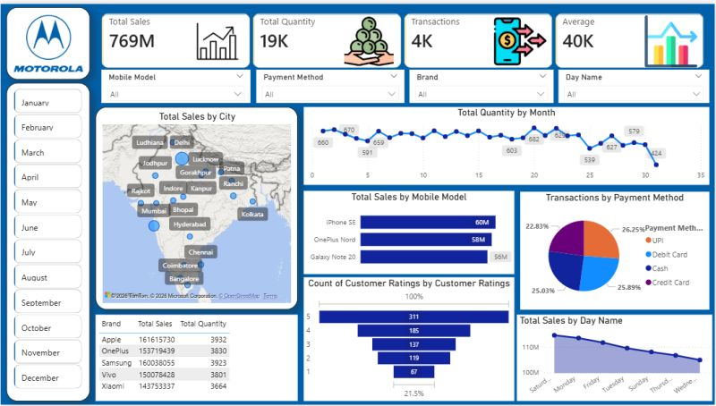

# Motorola Sales Dashboard (Power BI)

## Overview
This project is an interactive Power BI dashboard created to analyze mobile sales performance across different dimensions such as city, mobile model, payment method, and customer ratings.

## Dashboard Highlights
- Total Sales: 769M
- Total Quantity: 19K
- Total Transactions: 4K
- Average Sales: 40K

## Key Insights
- Sales performance by city using map visualization
- Quantity trend by month
- Sales by mobile model
- Transactions by payment method
- Customer ratings analysis
- Sales by day name and brand performance

## Tools Used
- Power BI
- Excel

## Files Included
- `Motorola_Sales_Dashboard.pbix` → Power BI dashboard file
- `Mobile_Sales_Data.xlsx` → Dataset used in the project
- `dashboard.png` → Dashboard preview

## Dashboard Preview

## What I Learned
- Data cleaning and modeling in Power BI
- KPI card design
- Interactive slicers and filters
- Trend analysis and business insights
- Dashboard layout and visualization selection

## Dataset Source
Dataset used for learning and practice purposes.
